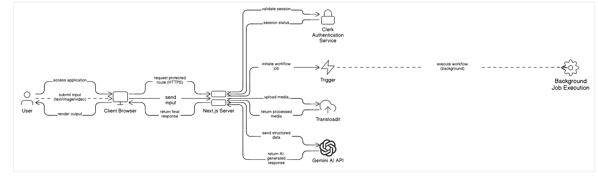

# AI Workflow

## Overview

AI Workflow is a web-based application designed to automate AI-driven processing using a structured, server-centric workflow. The system integrates authentication, media processing, workflow orchestration, and AI inference to handle complex requests securely and efficiently.

The application is built using **Next.js (App Router)** and deployed on **Vercel**, following production-grade architectural patterns.

---

## What the Workflow Does

At a high level, the workflow operates as follows:

1. Authenticated users submit input (text, image, or video).
2. Inputs are validated and processed server-side.
3. Media files are securely uploaded and transformed.
4. AI inference is performed using an external AI service.
5. Background workflows handle long-running or asynchronous tasks.
6. Final processed results are returned and rendered in the client.

---

## Tech Stack

- **Framework:** Next.js (App Router)
- **Authentication:** Clerk
- **AI Processing:** Google Gemini API
- **Media Processing:** Transloadit
- **Workflow Orchestration:** Trigger
- **Deployment Platform:** Vercel

---

## System Architecture and Workflow

The diagram below represents the **end-to-end system architecture and request–response flow** of the AI Workflow application.  
It combines both **high-level architecture** and **runtime sequence flow** for clarity.

### System Architecture & Sequence Diagram



---

## Architecture Explanation

### 1. User and Client Layer
- The user accesses the application via a browser.
- The client is implemented using **Next.js Client Components**.
- User inputs include text, images, or videos.
- All requests are sent over HTTPS.

---

### 2. Authentication Layer
- Protected routes require authentication.
- The **Next.js Server** validates the session using **Clerk Authentication**.
- Only authenticated requests proceed further in the workflow.

---

### 3. Server Layer (Core Orchestration)
- The **Next.js Server (App Router)** acts as the central orchestrator.
- Responsibilities include:
  - Input validation
  - Authentication enforcement
  - Workflow initiation
  - Secure communication with third-party services
- All secrets and credentials remain server-side.

---

### 4. Workflow Orchestration (Trigger)
- Background or long-running tasks are initiated using **Trigger**.
- Trigger manages workflow execution asynchronously to avoid blocking requests.

---

### 5. Media Processing (Transloadit)
- Media files are uploaded from the server to **Transloadit**.
- Image and video templates are applied securely.
- Processed media is returned to the server.
- The client never communicates directly with Transloadit.

---

### 6. AI Processing (Gemini AI API)
- Structured and processed data is sent to the **Gemini AI API**.
- AI inference is performed server-side.
- The AI-generated response is returned to the server.

---

### 7. Response Handling
- The server aggregates:
  - AI-generated output
  - Processed media (if applicable)
- A final response is returned to the client.
- The client renders the result to the user.

---

## Request–Response Flow (Summary)

1. User accesses the application.
2. Client requests a protected route.
3. Clerk validates the session.
4. User submits input.
5. Server validates and initiates workflow.
6. Trigger executes background tasks.
7. Media is processed via Transloadit (if required).
8. AI inference is performed using Gemini.
9. Server aggregates results.
10. Final response is rendered in the client.

---

## Design Principles

- **Server-First Security**
  - Secrets and API keys are never exposed to the client.
- **Separation of Concerns**
  - UI, authentication, workflows, media processing, and AI inference are decoupled.
- **Scalability**
  - Serverless deployment and background jobs enable horizontal scaling.
- **Deterministic Flow**
  - Each request follows a predictable and traceable execution path.

---

## How to Use This Project Locally

### 1. Clone the Repository
```bash
git clone <repository-url>
cd <repository-name>
````

### 2. Install Dependencies

```bash
npm install
```

### 3. Configure Environment Variables

Create a `.env.local` file in the project root and add the variables listed below.

### 4. Run the Development Server

```bash
npm run dev
```

The application will be available at:

```
http://localhost:3000
```

---

## Environment Variables

### Clerk (Authentication)

```
NEXT_PUBLIC_CLERK_PUBLISHABLE_KEY=
CLERK_SECRET_KEY=
NEXT_PUBLIC_CLERK_SIGN_IN_URL=/sign-in
NEXT_PUBLIC_CLERK_SIGN_UP_URL=/sign-up
```

### AI (Google Gemini)

```
GEMINI_API_KEY=
```

### Workflow Orchestration (Trigger)

```
TRIGGER_SECRET_KEY=
```

### Media Processing (Transloadit)

```
NEXT_PUBLIC_TRANSLOADIT_KEY=
TRANSLOADIT_SECRET=
NEXT_PUBLIC_IMAGE_TEMPLATE_ID=
NEXT_PUBLIC_VIDEO_TEMPLATE_ID=
```

> Notes:
>
> * Variables prefixed with `NEXT_PUBLIC_` are exposed to the client.
> * All other variables must remain server-side only.
> * Never commit environment files to version control.

---

## Deployment

The application is designed for deployment on Vercel.

Steps:

1. Import the repository into Vercel.
2. Add all environment variables in **Project Settings → Environment Variables**.
3. Deploy the project.
4. Redeploy whenever environment variables are updated.

---

## License

This project is proprietary and not open source.

```
Copyright (c) 2026–Present Shubrajit Deb
All rights reserved.
```

---

## Notes for Reviewers

* The system follows production-grade architectural practices.
* Sensitive operations are isolated to the server.
* The diagram reflects both structure and runtime behavior.

```


